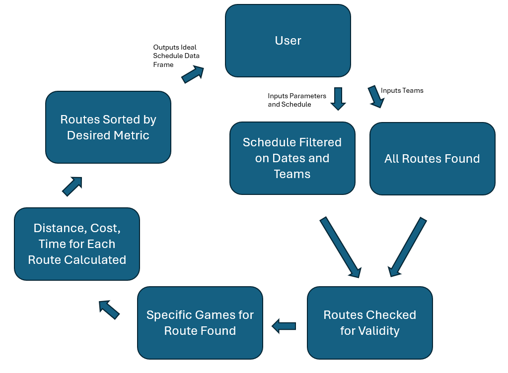

## Packages

### Distance

This file contains the functions used to calculate the distance between two points and build a distance matrix between several locations.

### Search

This file contains the functions used to create a schedule based on the desired teams and dates, optimized by cost, time or distance.

