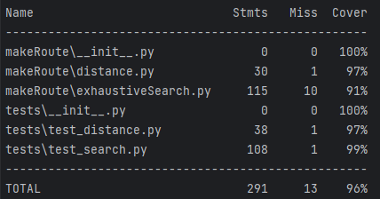

# Baseball Stadium Travels

## Testing

This directory contains the test files for the baseball stadium travels project. 


### Unit Tests
To run the unit tests for search and distance, run the following:

```commandline
python -m tests.test_search
python -m tests.test_distance
```

### Coverage

To run the coverage tests, run:

```commandline
pip install coverage
python -m coverage run -m unittest discover
python -m coverage report      
```

#### Last Results



